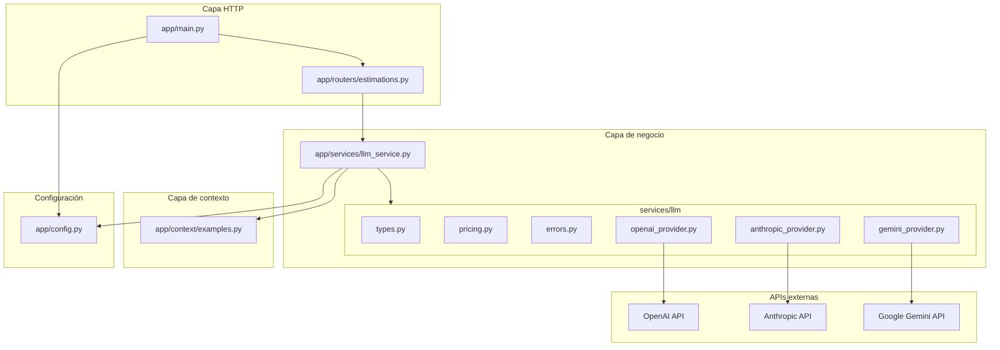
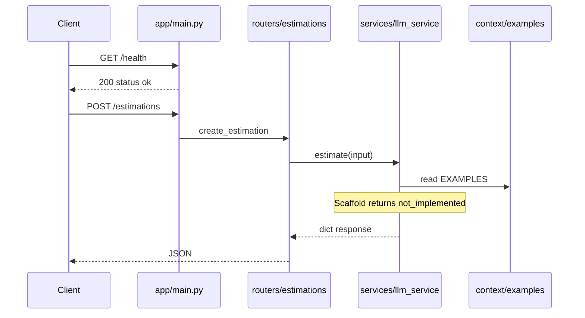
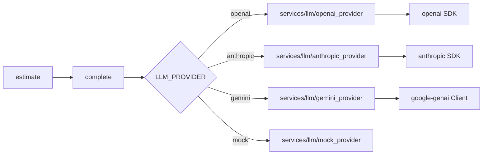
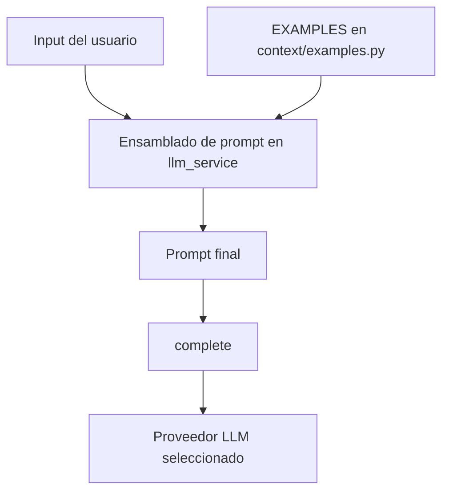

# Arquitectura

Este documento describe la arquitectura **actual** de `cag-estimator`. Es la fuente de verdad para
la estructura del sistema, los límites entre capas y el flujo de datos.

**Mantenedores y asistentes de código:** cuando cambies límites (nuevas capas, routers, servicios,
proveedores, configuración o flujo de contexto CAG), actualiza este archivo en el **mismo conjunto de cambios** que el código.
Consulta [`CONVENTION.md`](CONVENTION.md) y `CLAUDE.md` / `.cursorrules` en la raíz del repositorio.

---

## Objetivos

- **Generación aumentada con caché (CAG):** los datos de referencia estáticos se inyectan en los prompts desde `app/context/`.
- **Separación escalable:** HTTP, lógica de negocio y contexto de prompts permanecen en paquetes distintos.
- **LLM multi-proveedor:** OpenAI, Anthropic y Gemini son seleccionables en tiempo de ejecución mediante configuración.

---

## Estructura por capas

| Capa | Paquete | Responsabilidad |
|------|---------|-----------------|
| HTTP | `app/routers/` | Enrutamiento, modelos request/response, códigos de estado |
| Negocio | `app/services/` | Orquestación de estimaciones, ensamblado de prompts, llamadas LLM |
| Contexto | `app/context/` | Datos CAG estáticos (ejemplos, plantillas) — sin imports HTTP ni SDK |
| Configuración | `app/config.py` | Settings desde el entorno del proceso (`.env` o Infisical en dev; Infisical o env de plataforma en prod) |
| Entrada | `app/main.py` | Factory de la app FastAPI, registro de routers, health check |

**Regla de dependencias (estricta):**

```text
routers  →  services  →  context
              ↓
           config
```

Los routers **no** deben importar `app.context` directamente. Los servicios son dueños del ensamblado de prompts y pueden leer `EXAMPLES`.

---

## Layout del repositorio

```text
cag-estimator/
├── app/
│   ├── main.py              # App FastAPI, /health
│   ├── config.py            # pydantic-settings
│   ├── routers/
│   │   └── estimations.py   # POST /estimations
│   ├── services/
│   │   ├── llm_service.py   # fachada: complete()/stream_complete(), estimate()
│   │   └── llm/             # adaptadores de proveedor + tipos compartidos
│   │       ├── types.py
│   │       ├── pricing.py
│   │       ├── errors.py
│   │       ├── openai_provider.py
│   │       ├── anthropic_provider.py
│   │       └── gemini_provider.py
│   └── context/
│       └── examples.py      # EXAMPLES (caché CAG)
├── docs/
│   ├── ARCHITECTURE.md      # versión en inglés
│   ├── ARCHITECTURE.es.md   # este archivo
│   └── CONVENTION.md
└── pyproject.toml
```

---

## Diagrama de componentes



---

## Flujo de request (scaffold actual)



**Flujo futuro:** `estimate()` construirá un prompt a partir de `EXAMPLES` + input del usuario y luego llamará a `complete()`
(que despacha al proveedor configurado).

---

## Despacho de proveedores LLM

La selección en tiempo de ejecución usa `LLM_PROVIDER` (`openai` | `anthropic` | `gemini` | `mock`). Las claves API se validan cuando
se ejecuta `complete()`, no al importar la aplicación, de modo que `/health` funciona con un `.env` vacío.



| Proveedor | Clave de entorno | Modelo por defecto si `LLM_MODEL` no está definido |
|-----------|------------------|-----------------------------------------------------|
| `openai` | `OPENAI_API_KEY` | `gpt-4o-mini` |
| `anthropic` | `ANTHROPIC_API_KEY` | `claude-haiku-4-5-20251001` |
| `gemini` | `GOOGLE_API_KEY` | `gemini-2.5-flash` |
| `mock` | — | `mock-1` |

---

## CAG (generación aumentada con caché)

Los ejemplos estáticos viven en `app/context/examples.py` como `EXAMPLES: list[dict]`. La capa de servicios fusiona
esta caché en los prompts antes de llamar al LLM.



**Intención de diseño:** los datos de contexto cambian poco; mantenerlos fuera de routers y del código SDK facilita
actualizaciones y pruebas.

---

## Configuración

Los settings se cargan desde el **entorno del proceso** vía `pydantic-settings` ([`app/config.py`](../app/config.py)).
El `LLM_PROVIDER` activo debe tener su clave API configurada al arranque (excepto `mock`).

### Fuentes

| Fuente | Cuándo |
|--------|--------|
| **Infisical** | Desarrollo o producción/CI — `infisical run` inyecta variables antes de iniciar el proceso |
| **`.env` local** | Desarrollo sin Infisical — se carga con `env_file=".env"` |

**Precedencia:** el entorno del proceso tiene prioridad sobre `.env` (los valores inyectados por Infisical ganan sobre archivos locales obsoletos).
No pasa nada si falta `.env` cuando todas las variables vienen de Infisical o del shell.

Los nombres de secretos en Infisical deben coincidir con `.env.example`. No hagas commit de `.env` (ver `CLAUDE.md`).

### Variables

| Variable | Por defecto | Propósito |
|----------|-------------|-----------|
| `LLM_PROVIDER` | `openai` | `openai`, `anthropic`, `gemini` o `mock` |
| `LLM_MODEL` | `gpt-4o-mini` | Id de modelo; hay defaults por proveedor si no se define en el entorno |
| `OPENAI_API_KEY` | — | Requerida cuando `LLM_PROVIDER=openai` |
| `ANTHROPIC_API_KEY` | — | Requerida cuando `LLM_PROVIDER=anthropic` |
| `GOOGLE_API_KEY` | — | Requerida cuando `LLM_PROVIDER=gemini` |
| `APP_ENV` | `development` | Etiqueta de entorno de ejecución |
| `LOG_LEVEL` | `DEBUG` | Nivel de logging (`DEBUG` … `CRITICAL`) |

---

## Guía de extensión

Al añadir funcionalidad, preserva los límites entre capas:

| Cambio | Actualizar |
|--------|------------|
| Nuevo endpoint HTTP | `app/routers/` (+ registrar en `app/main.py`) |
| Nueva regla de negocio o comportamiento LLM | `app/services/` |
| Nuevo prompt estático / dato CAG | `app/context/` |
| Nueva variable de entorno o proveedor | `app/config.py`, tabla de env en README, **este archivo** |
| Nueva dependencia externa | `pyproject.toml`, **este archivo** si es arquitectónico |

---

## Documentación relacionada

- [`CONVENTION.md`](CONVENTION.md) — commits, PRs y expectativas de actualización de docs
- [`../README.es.md`](../README.es.md) — instalación, comandos de ejecución, árbol del proyecto
- [`ARCHITECTURE.md`](ARCHITECTURE.md) — versión en inglés de este documento
