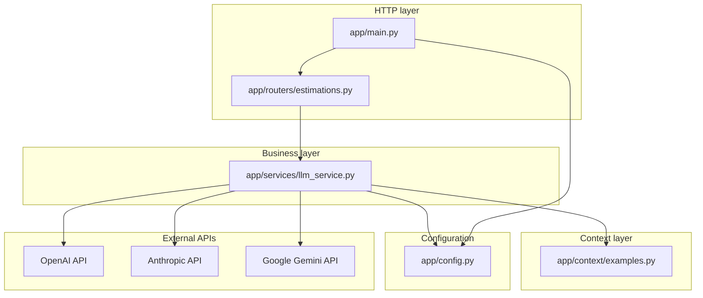
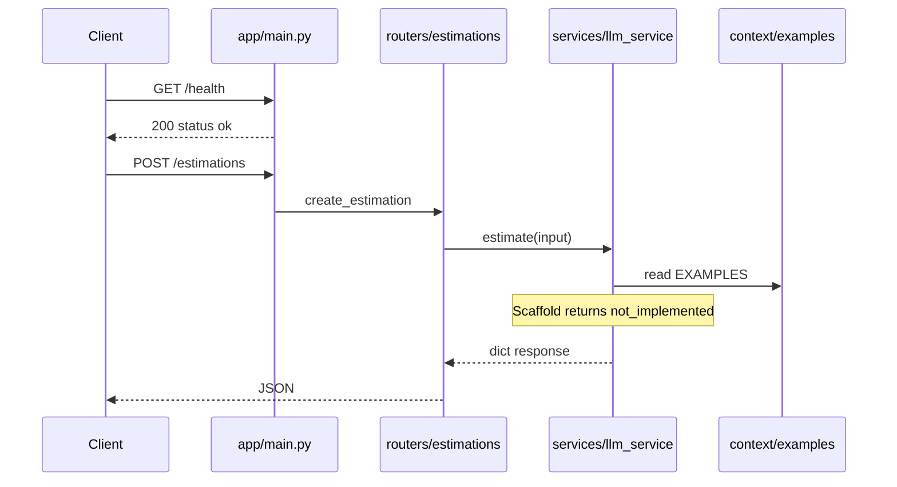
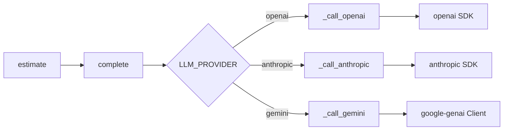
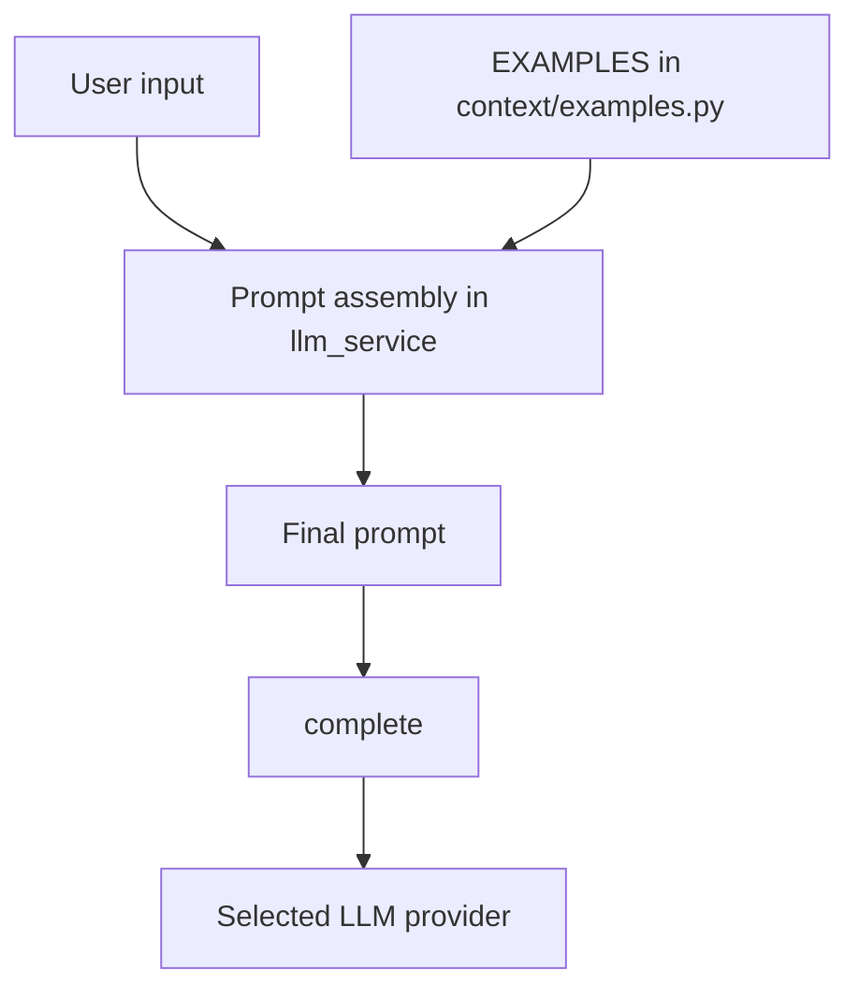

# Architecture

This document describes the **current** architecture of `estimador-cag`. It is the source of truth for
system structure, layer boundaries, and data flow.

**Maintainers and coding assistants:** when you change boundaries (new layers, routers, services,
providers, config, or CAG context flow), update this file in the **same change set** as the code.
See [`CONVENTION.md`](CONVENTION.md) and root `CLAUDE.md` / `.cursorrules`.

---

## Goals

- **Cache-augmented generation (CAG):** static reference data is injected into prompts from `app/context/`.
- **Scalable separation:** HTTP, business logic, and prompt context stay in distinct packages.
- **Multi-provider LLM:** OpenAI, Anthropic, and Gemini are selectable at runtime via configuration.

---

## Layered structure

| Layer | Package | Responsibility |
|-------|---------|----------------|
| HTTP | `app/routers/` | Routing, request/response models, status codes |
| Business | `app/services/` | Estimation orchestration, prompt assembly, LLM calls |
| Context | `app/context/` | Static CAG data (examples, templates) — no HTTP or SDK imports |
| Config | `app/config.py` | Settings from environment (`.env` locally, Infisical in deployed envs) |
| Entry | `app/main.py` | FastAPI app factory, router registration, health check |

**Dependency rule (strict):**

```text
routers  →  services  →  context
              ↓
           config
```

Routers must **not** import `app.context` directly. Services own prompt assembly and may read `EXAMPLES`.

---

## Repository layout

```text
estimador-cag/
├── app/
│   ├── main.py              # FastAPI app, /health
│   ├── config.py            # pydantic-settings
│   ├── routers/
│   │   └── estimations.py   # POST /estimations
│   ├── services/
│   │   └── llm_service.py   # complete(), estimate(), provider adapters
│   └── context/
│       └── examples.py      # EXAMPLES (CAG cache)
├── docs/
│   ├── ARCHITECTURE.md      # this file
│   └── CONVENTION.md
└── pyproject.toml
```

---

## Component diagram



---

## Request flow (current scaffold)



**Future flow:** `estimate()` will build a prompt from `EXAMPLES` + user input, then call `complete()`
(which dispatches to the configured provider).

---

## LLM provider dispatch

Runtime selection uses `LLM_PROVIDER` (`openai` | `anthropic` | `gemini`). API keys are validated when
`complete()` runs, not at application import, so `/health` works with an empty `.env`.



| Provider | Env key | Default model if `LLM_MODEL` unset |
|----------|---------|--------------------------------------|
| `openai` | `OPENAI_API_KEY` | `gpt-4o-mini` |
| `anthropic` | `ANTHROPIC_API_KEY` | `claude-3-5-haiku-latest` |
| `gemini` | `GOOGLE_API_KEY` | `gemini-2.0-flash` |

---

## CAG (cache-augmented generation)

Static examples live in `app/context/examples.py` as `EXAMPLES: list[dict]`. The service layer merges
this cache into prompts before calling the LLM.



**Design intent:** context data changes rarely; keeping it out of routers and out of SDK code makes
updates and testing easier.

---

## Configuration

| Variable | Purpose |
|----------|---------|
| `LLM_PROVIDER` | `openai`, `anthropic`, or `gemini` |
| `OPENAI_API_KEY` | OpenAI credential |
| `ANTHROPIC_API_KEY` | Anthropic credential |
| `GOOGLE_API_KEY` | Gemini credential |
| `LLM_MODEL` | Optional override; provider defaults apply if omitted |

Settings are loaded via `pydantic-settings` with `env_file=".env"` for local development. Production
secrets should come from **Infisical** (see root `CLAUDE.md`), not committed files.

---

## Extension guidelines

When adding features, preserve layer boundaries:

| Change | Update |
|--------|--------|
| New HTTP endpoint | `app/routers/` (+ register in `app/main.py`) |
| New business rule or LLM behavior | `app/services/` |
| New static prompt / CAG data | `app/context/` |
| New env var or provider | `app/config.py`, README env table, **this file** |
| New external dependency | `pyproject.toml`, **this file** if architectural |

---

## Related documentation

- [`CONVENTION.md`](CONVENTION.md) — commits, PRs, and doc-update expectations
- [`../README.md`](../README.md) — setup, run commands, project tree
